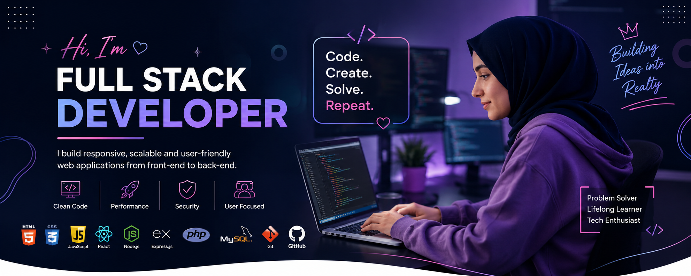

<h1>Hi 👋, I'm Suad Abdullahi Ali</h1>

<h3>🚀 Full Stack Developer | Web Developer | Problem Solver</h3>

I build modern, responsive, and scalable web applications.
Passionate about creating clean UI, powerful backend systems,
and learning new technologies every day.

---

## 👨‍💻 About Me

Hi, I'm **Suad Abdullahi Ali**, a passionate **Full Stack Developer** who loves building complete web solutions from frontend to backend.

I enjoy transforming ideas into real applications using modern technologies. 
My goal is to create software that is simple, fast, secure, and user-friendly.

🌱 Currently learning and improving:
- Advanced Full Stack Development
- Database Design
- Backend Architecture
- Modern Web Technologies

💡 My interests:
- Web Application Development
- Software Engineering
- Open Source Projects
- Problem Solving

---

## 🛠️ Languages and Tools

---

## 🚀 What I Do

✅ Frontend Development  
- Responsive UI Design
- Modern React Applications
- User Experience Improvement

✅ Backend Development  
- REST API Development
- Database Management
- Server-side Applications

✅ Full Stack Development  
- Connecting Frontend & Backend
- Building Complete Web Systems
- Application Deployment

---

## 🔥 My Goals

🚀 Become an advanced Full Stack Engineer  
🌍 Build useful applications for people  
📚 Keep improving my programming skills  
🤝 Contribute to open-source projects  

---

## 🤝 Connect With Me

---

### ⭐ Thanks for visiting my profile!

